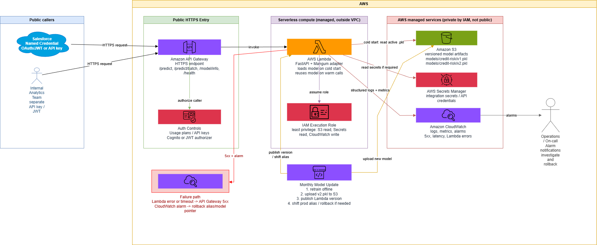

# Part B - AWS Deployment Design

## Architecture Summary

The Part A FastAPI credit risk API should be deployed using **Amazon API Gateway + AWS Lambda** in the **Asia Pacific Mumbai (`ap-south-1`) region**. The API receives low daily volume, about 500 predictions/day with short campaign spikes to about 2,000/day, so Lambda gives simpler operations and pay-per-use scaling without running containers continuously.

The trained model artifact is stored in **S3** as a versioned `.pkl`, for example `s3://niwas-credit-models/models/credit-risk/v1.pkl`. On Lambda cold start, the function downloads the active model version from S3 into `/tmp`, loads it into memory, and reuses the model for warm invocations. Lambda logs, structured prediction logs, errors, and latency metrics go to **CloudWatch Logs and Alarms**.

See [`architecture.drawio`](architecture.drawio) for the editable architecture diagram.

## Q1 - Lambda vs ECS

I would deploy this API on **AWS Lambda** behind **API Gateway** for Niwas HFC's expected load. The API is a small Python service with a scikit-learn model, and the request pattern is low and bursty rather than continuously high. Lambda automatically scales during campaign spikes and costs almost nothing when idle, which fits 500 to 2,000 predictions/day better than always-running ECS tasks.

The main trade-off is cold start latency. The function must load FastAPI, scikit-learn, pandas, and the `.pkl` model, then download or read the model artifact. For this assignment-sized model, that is acceptable. If the model grows large, latency targets become stricter, or traffic becomes consistently high throughout the day, I would switch to **ECS** with a small always-on service behind an Application Load Balancer or API Gateway HTTP integration. ECS is also better if the API needs long-running jobs, more predictable warm capacity, or heavier native dependencies.

## Q2 - Model Update Without Downtime

Monthly retraining produces a new model artifact, for example `v2.pkl`. The offline training pipeline validates the model, then uploads it to a versioned S3 path such as `models/credit-risk/v2.pkl`. The Lambda function reads the active model key from an environment variable or config value, for example `MODEL_S3_KEY=models/credit-risk/v2.pkl`.

Deployment is done with Lambda versions and aliases. A new Lambda version is published with the updated model pointer, then traffic is shifted gradually through an alias such as `prod`: first 10% to the new version, then 100% after CloudWatch confirms normal error rate, latency, and prediction behavior. The API remains online because API Gateway continues routing to the `prod` alias throughout the rollout.

Rollback is simple: move the `prod` alias back to the previous Lambda version or change the model pointer back to `models/credit-risk/v1.pkl` and redeploy. S3 versioning keeps old artifacts available, and CloudWatch alarms alert operators if the new version causes 5xx errors, high latency, or abnormal prediction volumes.

## Q3 - Rough Monthly Cost Estimate

At roughly 500 requests/day, the system handles about 15,000 requests/month. This should be a low-cost serverless deployment, likely only a few USD per month for API Gateway, Lambda, S3 storage, and CloudWatch logs, assuming the model remains small and request payloads are modest.

The two main cost drivers are **API Gateway request charges** and **Lambda compute duration**, especially cold starts that load the Python runtime and model. CloudWatch log volume is a secondary driver if every prediction logs many fields. To minimize cost, keep the model artifact small, cache it in Lambda memory after cold start, avoid unnecessary VPC networking, set CloudWatch log retention, and enable provisioned concurrency only if latency requirements justify the extra cost.
